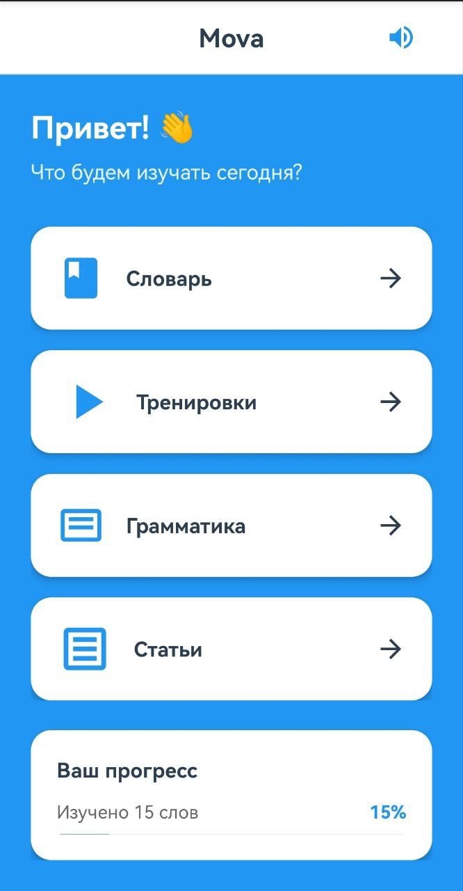
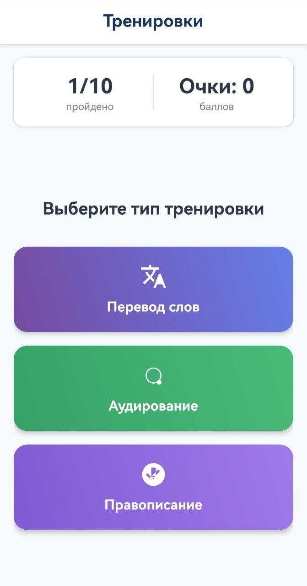
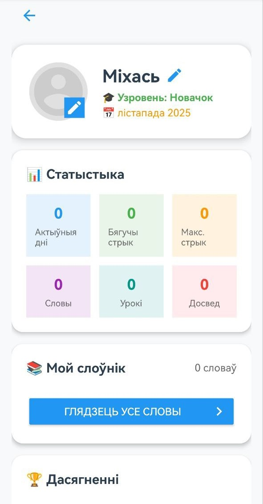

# Mova-Learning-Android
Mova Learning App — An Android application for learning the Belarusian language. 
Includes grammar modules, personal dictionaries, and progress tracking. 
Developed as a personal project to master Android SDK and Java.

Check out the screenshots of the Mova Learning App:

<table>
  <tr>
    <td></td>
    <td></td>
    <td></td>
    <td></td>
  </tr>
  <tr>
    <td></td>
    <td></td>
    <td></td>
    <td></td>
  </tr>
</table>
